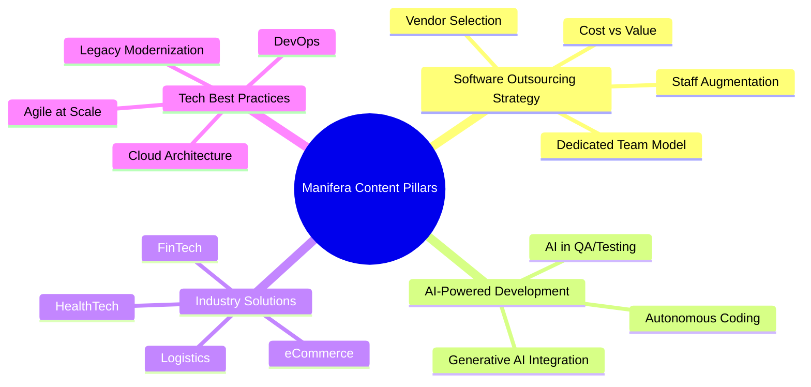
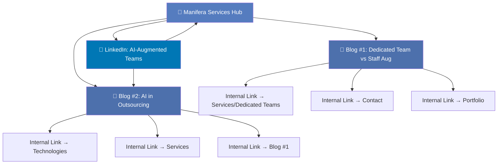

# 📋 Kế Hoạch Content Strategy & Keywords — Tháng 6/2026
## Manifera.com | Software Development Outsourcing

---

## 1. Tổng Quan Manifera

| Thông tin | Chi tiết |
|:---|:---|
| **Tên công ty** | Manifera Software Development |
| **Trụ sở** | HCM City (Vietnam), Singapore, Netherlands |
| **Thành lập** | ~2015 |
| **Dịch vụ chính** | Custom Software Development, Web Apps, Mobile Apps, eCommerce, Dedicated Teams |
| **Mô hình** | Agile/Scrum, kết hợp quản lý Hà Lan + kỹ sư Việt Nam |
| **Khách hàng mục tiêu** | CTOs, VPs of Engineering, Founders tại châu Âu, Mỹ, Đông Nam Á |
| **Website** | [manifera.com](https://manifera.com) |
| **Tagline hiện tại** | "Experienced, Reliable Software Development Teams" |

### Dịch Vụ Chi Tiết

- 🖥️ **Custom Software Development** — Web apps, business applications
- 📱 **Mobile App Development** — iOS, Android, cross-platform
- 🛒 **eCommerce Development** — Platforms & custom solutions
- 👥 **Dedicated Development Teams** — Offshore team model
- ☁️ **Cloud & DevOps** — Cloud-native architecture
- 🤖 **AI/ML Integration** — AI-powered solutions

### Công Nghệ

`React` `Angular` `Vue.js` `Node.js` `Python` `PHP/Laravel` `.NET` `Java` `React Native` `Flutter` `AWS` `Azure` `Docker` `Kubernetes`

---

## 2. Content Pillars (Trụ Cột Nội Dung)



| Pillar | Lý Do Chọn | Liên Kết Dịch Vụ |
|:---|:---|:---|
| **Software Outsourcing Strategy** | Keyword volume cao, trực tiếp liên quan đến core service | Dedicated Teams, Custom Dev |
| **AI-Powered Development** | Trending topic 2026, thể hiện năng lực tiên tiến | AI/ML Integration |
| **Industry Solutions** | Nhắm niche verticals, high-intent leads | Tất cả dịch vụ |
| **Tech Best Practices** | Build authority, SEO dài hạn | Cloud, DevOps, Custom Dev |

---

## 3. Keyword Research — Tháng 6/2026

### Bảng Keywords Ưu Tiên

| # | Keyword | Volume (Est.) | Difficulty | Buyer Stage | Content Type | Priority |
|:--|:---|:--|:--|:--|:--|:--|
| 1 | **dedicated development team Vietnam** | 1,200/mo | Medium | Consideration | Blog (Searchable) | ⭐⭐⭐⭐⭐ |
| 2 | **AI software development outsourcing** | 880/mo | Medium-High | Awareness | Blog (Searchable) | ⭐⭐⭐⭐⭐ |
| 3 | **software outsourcing Vietnam 2026** | 720/mo | Medium | Consideration | Blog (Searchable) | ⭐⭐⭐⭐ |
| 4 | **dedicated team vs staff augmentation** | 590/mo | Low-Medium | Consideration | Blog (Searchable) | ⭐⭐⭐⭐ |
| 5 | **offshore development center Vietnam** | 480/mo | Medium | Decision | Service Page | ⭐⭐⭐⭐ |
| 6 | **how to hire offshore developers** | 1,400/mo | Medium | Awareness | Blog (Searchable) | ⭐⭐⭐ |
| 7 | **AI-augmented engineering teams** | 320/mo | Low | Awareness | LinkedIn (Shareable) | ⭐⭐⭐⭐ |
| 8 | **legacy system modernization outsourcing** | 260/mo | Low-Medium | Consideration | Blog | ⭐⭐⭐ |
| 9 | **Vietnam IT outsourcing advantages** | 390/mo | Medium | Awareness | Blog | ⭐⭐⭐ |
| 10 | **cost of software development Vietnam** | 640/mo | Medium-High | Decision | Blog | ⭐⭐⭐ |

### Keywords Phụ (LSI / Long-tail)

- "agile software development outsourcing"
- "custom software development company Vietnam"
- "ecommerce development outsourcing"
- "fintech software outsourcing Vietnam"
- "healthcare software development outsourcing"
- "scalable engineering teams Vietnam"
- "build remote development team Vietnam"
- "Dutch-managed offshore team Vietnam"

---

## 4. Kế Hoạch Nội Dung Tháng 6/2026

### Tổng Quan Lịch

| Tuần | Kênh | Nội Dung | Keyword Chính | Loại |
|:--|:--|:---|:--|:--|
| **Tuần 1** (2-6/6) | 🌐 Website Blog #1 | Dedicated Team vs Staff Augmentation | dedicated team vs staff augmentation | Searchable |
| **Tuần 2** (9-13/6) | 💼 LinkedIn Post | AI-Augmented Engineering | AI-augmented engineering teams | Shareable |
| **Tuần 3-4** (16-27/6) | 🌐 Website Blog #2 | AI Software Development Outsourcing | AI software development outsourcing | Searchable + Shareable |

---

## 5. Chi Tiết Bài Viết

---

### 📝 BLOG #1 — Website (manifera.com/blog/)

> **Xuất bản:** Tuần 1 (2-6/6/2026)

#### Thông Tin Bài Viết

| Mục | Chi tiết |
|:---|:---|
| **Tiêu đề** | Dedicated Team vs Staff Augmentation in 2026: Which Model Fits Your Business? |
| **URL** | `/blog/dedicated-team-vs-staff-augmentation-2026` |
| **Keyword chính** | dedicated team vs staff augmentation |
| **Keywords phụ** | dedicated development team Vietnam, offshore team model, staff augmentation vs outsourcing, hire dedicated developers |
| **Buyer Stage** | Consideration |
| **Search Intent** | Commercial Investigation |
| **Loại content** | Searchable — Comparison/Guide |
| **Độ dài** | 2,000-2,500 từ |
| **Meta Title** | Dedicated Team vs Staff Augmentation (2026 Guide) — Manifera |
| **Meta Description** | Compare dedicated teams vs staff augmentation for 2026. Learn which outsourcing model delivers better ROI, scalability, and team culture fit for your project. |

#### Outline Chi Tiết

```
H1: Dedicated Team vs Staff Augmentation in 2026: Which Model Fits Your Business?

  [Hero Image: Infographic comparing two models side by side]

  Introduction (150 từ)
  - Hook: "Năm 2026, 78% CTOs ưu tiên partnership dài hạn hơn thuê theo dự án"
  - Vấn đề: Chọn sai mô hình = lãng phí ngân sách + trễ deadline
  - Promise: So sánh toàn diện giúp bạn quyết định đúng

  H2: What Is a Dedicated Team Model?
  - Định nghĩa: Đội ngũ dành riêng, full-time, tích hợp văn hóa
  - Cách hoạt động tại Manifera (Agile/Scrum, quản lý Hà Lan)
  - Phù hợp cho: Long-term products, complex systems, R&D

  H2: What Is Staff Augmentation?
  - Định nghĩa: Bổ sung nhân sự ngắn hạn vào team in-house
  - Cách hoạt động
  - Phù hợp cho: Skill gaps, peak workloads, specific expertise

  H2: Head-to-Head Comparison (Bảng so sánh)
  
  | Tiêu chí | Dedicated Team | Staff Augmentation |
  |:---|:---|:---|
  | Timeline | 6+ months | 1-6 months |
  | Control | Shared management | Full client control |
  | Cost Structure | Monthly retainer | Hourly/daily rate |
  | Scalability | High (grow with product) | Limited |
  | Knowledge Retention | ✅ Stays with team | ❌ Leaves with person |
  | Cultural Fit | Deep integration | Surface level |
  | Best For | Product companies | Project-based needs |

  H2: When to Choose a Dedicated Team (5 signals)
  1. Bạn đang xây dựng sản phẩm dài hạn
  2. Cần team hiểu sâu business domain
  3. Muốn scalable capacity
  4. Quan tâm đến developer retention
  5. Cần team tích hợp vào Agile workflow

  H2: When to Choose Staff Augmentation (5 signals)
  1. Cần skill cụ thể trong ngắn hạn
  2. Đang có team in-house mạnh
  3. Dự án có deadline rõ ràng
  4. Budget giới hạn
  5. Không cần knowledge transfer dài hạn

  H2: The Hidden Costs of Choosing Wrong
  - Chi phí ẩn khi thuê freelancers/cheap vendors
  - Ramp-up time, re-hiring costs, IP security risks
  - Data: Trung bình mất 3-6 tháng để dedicated team đạt full productivity

  H2: How Manifera's Dedicated Team Model Works
  - Quy trình 4 bước: Discovery → Team Assembly → Integration → Delivery
  - Dutch management + Vietnamese engineering = chất lượng châu Âu, chi phí tối ưu
  - Case study ngắn hoặc social proof

  H2: Making the Right Decision: A Quick Framework
  - Decision tree / flowchart
  - 5 câu hỏi tự đánh giá

  Conclusion + CTA
  - Tóm tắt key takeaways
  - CTA: "Ready to build your dedicated team? Talk to our experts →"
  - Internal link đến trang Services và Contact
```

#### SEO Checklist
- [x] Keyword chính trong H1, meta title, URL, đoạn mở đầu
- [x] Comparison table (Google loves structured data)
- [x] FAQ Schema cho 3-5 câu hỏi phổ biến
- [x] Internal links: Services page, Portfolio, Contact
- [x] External links: Industry reports, statistics
- [x] Alt text cho tất cả hình ảnh
- [x] Breadcrumb: Home > Blog > Dedicated Team vs Staff Augmentation

---

### 📝 BLOG #2 — Website (manifera.com/blog/)

> **Xuất bản:** Tuần 3-4 (16-27/6/2026)

#### Thông Tin Bài Viết

| Mục | Chi tiết |
|:---|:---|
| **Tiêu đề** | How AI Is Transforming Software Development Outsourcing in 2026 |
| **URL** | `/blog/ai-software-development-outsourcing-2026` |
| **Keyword chính** | AI software development outsourcing |
| **Keywords phụ** | AI-powered software development Vietnam, generative AI development services, AI-augmented engineering, autonomous coding services, AI in software testing |
| **Buyer Stage** | Awareness → Consideration |
| **Search Intent** | Informational + Commercial |
| **Loại content** | Searchable + Shareable (Thought Leadership + Guide) |
| **Độ dài** | 2,500-3,000 từ |
| **Meta Title** | AI in Software Development Outsourcing (2026 Guide) — Manifera |
| **Meta Description** | Discover how AI transforms software outsourcing in 2026. From AI-augmented coding to automated QA — learn what to expect from your development partner. |

#### Outline Chi Tiết

```
H1: How AI Is Transforming Software Development Outsourcing in 2026

  [Hero Image: AI + Development Team collaboration visualization]

  Introduction (200 từ)
  - Hook: "AI không thay thế developers — nó biến họ thành super-developers"
  - Statistic: "Các đội ngũ sử dụng AI tools tăng 40% productivity trong H1/2026"
  - Thesis: Outsourcing partners tích hợp AI = competitive advantage mới

  H2: The State of AI in Software Development (2026 Snapshot)
  - Tổng quan xu hướng: Copilot, cursor, autonomous agents
  - Thống kê thị trường outsourcing + AI ($1 trillion by 2030)
  - Tại sao AI thay đổi cách chọn outsourcing partner

  H2: 5 Ways AI Is Revolutionizing Outsourcing Workflows

    H3: 1. AI-Augmented Code Generation
    - Copilot, code completion, boilerplate generation
    - Impact: Developer tập trung vào logic phức tạp
    - Manifera's approach: Tool stack & training

    H3: 2. Automated Quality Assurance & Testing
    - AI-driven test generation, visual regression
    - Impact: Giảm 60% thời gian QA manual
    - Case example

    H3: 3. Intelligent Code Review & Security
    - AI phát hiện vulnerabilities, code smells
    - Impact: Chất lượng code cao hơn, ít tech debt

    H3: 4. Smart Project Management & Estimation
    - AI-powered sprint planning, effort estimation
    - Impact: Accurate timelines, fewer surprises

    H3: 5. Natural Language to Code (Low-Code AI)
    - Business stakeholders mô tả requirements → AI draft code
    - Impact: Faster prototyping, clearer communication

  H2: What This Means for Choosing an Outsourcing Partner
  - Checklist 7 câu hỏi cần hỏi vendor về AI readiness:
    1. Các developer có sử dụng AI coding tools không?
    2. AI được tích hợp vào QA pipeline như thế nào?
    3. Có training program cho AI tools không?
    4. Chính sách bảo mật khi sử dụng AI (code privacy)?
    5. AI được dùng trong project estimation không?
    6. Có track record với AI/ML projects không?
    7. Vision về AI trong 2-3 năm tới?

  H2: AI + Vietnam's Tech Ecosystem: Why It's a Winning Combination
  - Vietnam's AI talent pool đang tăng trưởng
  - Chi phí competitive + quality engineering
  - Dutch-Vietnamese model của Manifera: Best of both worlds
  - Government support cho AI/tech sector

  H2: Risks & Considerations
  - IP security khi dùng AI tools
  - Over-reliance on AI-generated code
  - Quality vs speed tradeoff
  - Cách Manifera mitigate risks

  H2: The Future: What to Expect in 2027 and Beyond
  - Predictions: Autonomous dev agents, AI architects
  - Implications cho outsourcing industry
  - Position: Partners who adapt now will lead

  Conclusion + CTA
  - Key takeaways (3 bullet points)
  - CTA: "Want an AI-ready development partner? Let's talk →"
  - Internal links: Technologies, Services, Portfolio
```

#### SEO Checklist
- [x] Keyword chính trong H1, meta title, URL, first paragraph
- [x] Numbered list (5 Ways) — Google ưu tiên cho featured snippets
- [x] Checklist format — shareable + bookmark-worthy
- [x] Data/statistics from credible sources
- [x] Internal links: Technologies, Services, About
- [x] Schema: Article + FAQ + HowTo

---

### 💼 LINKEDIN POST — Manifera Company Page

> **Đăng:** Tuần 2 (9-13/6/2026, tốt nhất thứ 3 hoặc thứ 4, 8-10am CET)

#### Thông Tin Bài Post

| Mục | Chi tiết |
|:---|:---|
| **Chủ đề** | AI-Augmented Engineering Teams — Tương lai của outsourcing |
| **Keyword focus** | AI-augmented engineering teams |
| **Mục tiêu** | Thought leadership, engagement, drive traffic to Blog #2 |
| **Loại content** | Shareable — Thought Leadership |
| **Format** | Text post + Carousel (optional) |
| **Target audience** | CTOs, VPs Engineering, Tech Leaders |

#### Nội Dung LinkedIn Post

```
🤖 AI doesn't replace developers — it makes them 10x more powerful.

At Manifera, we've been integrating AI tools into our development 
workflows, and the results are remarkable:

→ 40% faster code reviews with AI-assisted analysis
→ 60% reduction in manual QA time through AI-driven testing
→ 3x faster prototyping with AI code generation
→ Near-zero security blind spots with AI vulnerability scanning

But here's what most people get wrong about AI in outsourcing:

It's NOT about replacing developers with AI.
It's about choosing partners who empower their engineers WITH AI.

The question every CTO should ask their outsourcing partner in 2026:

"How are your developers using AI to deliver better results — faster?"

If they can't answer clearly, it's time to find a new partner.

---

We've written a deep-dive on how AI is transforming software 
outsourcing in 2026 — with a 7-question checklist to evaluate 
your vendor's AI readiness.

🔗 Read the full guide: [link to Blog #2]

#SoftwareDevelopment #AIEngineering #Outsourcing #Vietnam 
#DedicatedTeams #DigitalTransformation #Manifera #TechLeadership
```

#### LinkedIn Strategy Notes

| Mục | Chi tiết |
|:---|:---|
| **Hook** | Emoji + bold statement trong 2 dòng đầu (xuất hiện trước "See more") |
| **Format** | Dùng → arrows, line breaks, short paragraphs |
| **CTA** | Link đến Blog #2 (drive traffic) |
| **Engagement** | Đặt câu hỏi gợi mở → khuyến khích comment |
| **Thời gian đăng** | Thứ 3 hoặc thứ 4, 8-10am CET (peak cho audience EU) |
| **Follow-up** | Reply tất cả comments trong 2 giờ đầu |
| **Hashtags** | 5-8 hashtags, mix broad + niche |

#### Carousel Option (Nếu Muốn Tăng Engagement)

Tạo 6-8 slides:

| Slide | Nội Dung |
|:--|:---|
| 1 | **Cover:** "Is Your Outsourcing Partner AI-Ready?" |
| 2 | **Problem:** 73% of outsourcing vendors still use zero AI tools |
| 3 | **AI in Code:** AI-augmented coding = 40% faster delivery |
| 4 | **AI in QA:** Automated testing = 60% less manual effort |
| 5 | **AI in Security:** AI scans catch vulnerabilities humans miss |
| 6 | **Checklist:** 7 questions to ask your vendor |
| 7 | **CTA:** "Read the full guide → manifera.com/blog" |

---

## 6. Topic Cluster Map



---

## 7. Lịch Đăng Bài Chi Tiết

| Ngày | Kênh | Hành Động |
|:--|:--|:---|
| **2/6 (Thứ 2)** | Internal | Hoàn thành draft Blog #1 |
| **4/6 (Thứ 4)** | Internal | Review + SEO optimization Blog #1 |
| **5/6 (Thứ 5)** | 🌐 **Website** | **Publish Blog #1** — Dedicated Team vs Staff Augmentation |
| **6/6 (Thứ 6)** | Social | Share Blog #1 snippet lên LinkedIn |
| **9/6 (Thứ 2)** | Internal | Chuẩn bị LinkedIn Post content + carousel |
| **10/6 (Thứ 3)** | 💼 **LinkedIn** | **Publish LinkedIn Post** — AI-Augmented Engineering |
| **11-12/6** | LinkedIn | Engage với comments, reply, tag relevant people |
| **16/6 (Thứ 2)** | Internal | Hoàn thành draft Blog #2 |
| **18/6 (Thứ 4)** | Internal | Review + SEO optimization Blog #2 |
| **19/6 (Thứ 5)** | 🌐 **Website** | **Publish Blog #2** — AI in Software Outsourcing |
| **20/6 (Thứ 6)** | LinkedIn | Share Blog #2 với teaser post |
| **23-27/6** | All | Monitor performance, update internal links |

---

## 8. KPIs & Đo Lường

| Metric | Blog #1 Target | Blog #2 Target | LinkedIn Target |
|:--|:--|:--|:--|
| **Organic Traffic** (30 ngày) | 200-400 visits | 300-500 visits | N/A |
| **Avg. Time on Page** | > 3 phút | > 4 phút | N/A |
| **Bounce Rate** | < 65% | < 60% | N/A |
| **Impressions** | N/A | N/A | 5,000-15,000 |
| **Engagement Rate** | N/A | N/A | > 3% |
| **CTA Clicks** | 15-30 clicks | 20-40 clicks | 50-100 clicks |
| **Keyword Ranking** (3 tháng) | Top 20 | Top 20 | N/A |
| **Backlinks** (3 tháng) | 2-5 | 3-8 | N/A |

---

## 9. Đề Xuất Bổ Sung

> [!TIP]
> **Quick Wins cho tháng 7:**
> - Repurpose Blog #1 thành infographic → share trên LinkedIn
> - Tạo email newsletter từ key insights của Blog #2
> - Viết case study chi tiết cho 1 dự án thành công

> [!IMPORTANT]
> **Lưu ý SEO:**
> - Cả 2 blog nên được submit lên Google Search Console ngay sau khi publish
> - Thêm FAQ Schema cho mỗi blog (3-5 câu hỏi)
> - Update internal links từ các trang Services, About, và blog cũ

> [!NOTE]
> **Về ngôn ngữ:**
> - Blog viết bằng **tiếng Anh** (target audience quốc tế)
> - LinkedIn post bằng **tiếng Anh** (professional network quốc tế)
> - Có thể tạo phiên bản tiếng Việt nếu muốn target thị trường nội địa

---

*Kế hoạch được tạo ngày 6/6/2026 bởi Content Strategy Agent cho Manifera.com*
